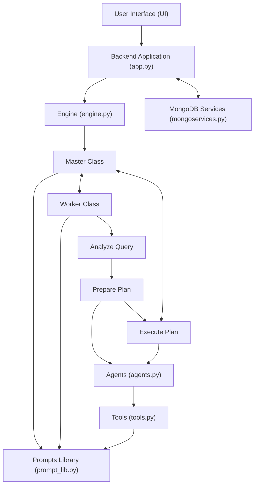

# Natwest Hackathon

## Code Structure

### User Interface (UI)
- **React-based frontend** where users input queries.

### Backend Application (`app.py`)
- **FastAPI-based microservices and WebSocket code**.
- Receives queries from the UI.
- Handles authentication via `mongoservices.py`.

### MongoDB Services (`mongoservices.py`)
- **Stores chat history and logs**.
- Maps generated answers to their data sources.
- Manages user authentication.

### Engine (`engine.py`)
- Contains the **Worker** and **Master** classes.

  #### Worker Class
  - Analyzes queries and breaks them into subtasks.
  - Uses chain-of-thought prompts to generate plans to execute subtasks.
  - eg: for query input like  what is the asset ratio of Kotak Bank in FY2022, plan generated will be
            plan(1, fetch, [annual_report_numerical_data_retriever], "Total assets of Kotak Bank in FY2022")
            plan(2, fetch, [annual_report_numerical_data_retriever], "Total liabilities of Kotak Bank in FY2022")
            plan(3, compute, [expert], "Compute the asset ratio for Kotak Bank in FY2022 as Asset Ratio = Total Assets / Total Liabilities")
            plan(4, report, [expert], "Report the computed asset ratio for Kotak Bank in FY2022")

  #### Master Class
  - Extracts and executes the plan.
  - Optimizes performance by parallelizing tasks when applicable (e.g., running multiple data fetches simultaneously)
  - Asses whether the execution is in the right directio  or not
  - Streams results back to the UI.

### Agents (`agents.py`)
- **AgentFunctionality** class chains multiple tools to create agents.
- Agents perform specific tasks as per the plan.

### Tools (`tools.py`)
- Contains independent tools for special purposes.
  - **Web search tool**: Takes a query and execute web search and returns results.
  - **Calculation tool**: Performs computations/calculations.
  - **Clarity tool**: Ask for clarity and refines queries.
  - **Data retrievers**: Fetch data from vector databases, SQL, etc.

### Prompts Library (`prompt_lib.py`)
- Contains all the prompts used by agents and tools.

## Code Flow Chart


## Work in Progress

### Self Improving Agents Pipeline - on the same agentic architecture

### User Interaction
- **User inputs a query**.
- Receives an **answer generated by the agents**.

### Feedback Collection
- **User provides feedback** on the answer.
- Feedback is stored in a **database**.

### Feedback Processing
- **Modules retrieve feedback data**.
- Data is used to **train and improve algorithms**.

### Agent Improvement
- **Modules update themselves** based on new training.
- **Algorithms are refined**.

### Master Class Optimization
- The **Master Class** uses improved modules.
- **Better selection of agents**.
- **Refinement of prompts**.

### Continuous Loop
- The **improved system** handles new queries.
- The cycle **repeats** with ongoing feedback and improvement.

## Flow Chart - Self Improving Agents
```mermaid
graph TD

    FeedbackDB["Feedback Stored in DB"] --> FeedbackProcessing["Feedback Processing"]
    FeedbackProcessing --> ModulesImproved["Modules Trained/Improved"]
    ModulesImproved --> MasterOptimization["Master and Worker Class Optimization"]
    MasterOptimization --> FeedbackDB
    MasterOptimization --> ImprovedAgents["Improved Agents & Prompts"]
    ImprovedAgents --> HandleNew["Handle New Queries"]
